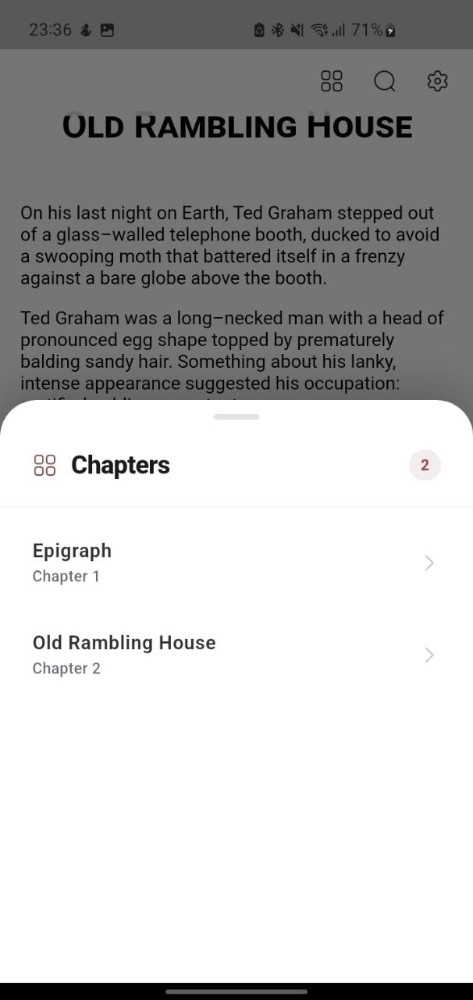
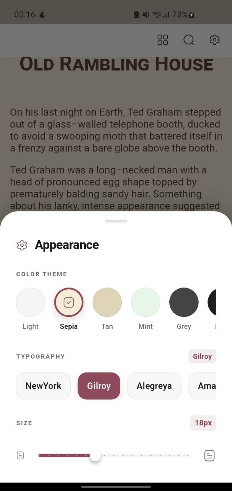
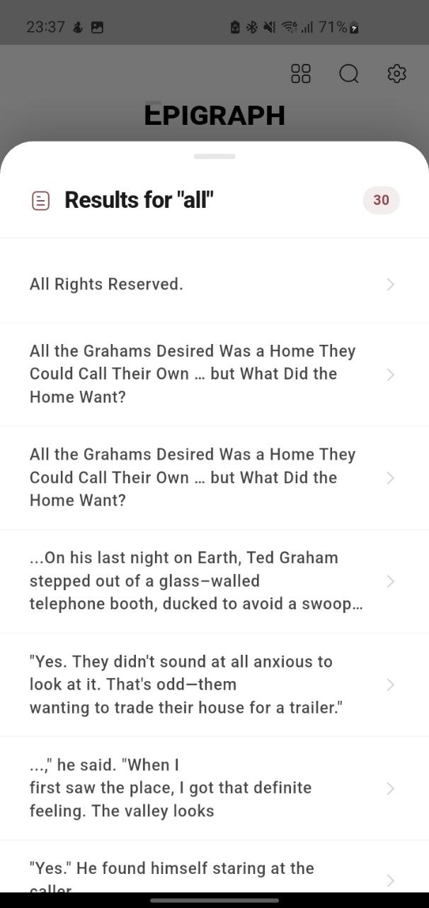

# sakura_epub

A powerful Flutter package for rendering EPUB books inside your app — forked from
[flutter_epub_viewer](https://pub.dev/packages/flutter_epub_viewer) by fayis.dev and extended with
additional features, bug fixes, and bundled assets.

Built on [epub.js](https://github.com/futurepress/epub.js/) and
[flutter_inappwebview](https://pub.dev/packages/flutter_inappwebview).

---

## Screenshots

<table>
  <tr>
    <td align="center" width="25%">
      <br/>
      <sub><b>Reading View</b></sub>
    </td>
    <td align="center" width="25%">
      <br/>
      <sub><b>Chapter List</b></sub>
    </td>
    <td align="center" width="25%">
      <br/>
      <sub><b>Appearance Settings</b></sub>
    </td>
    <td align="center" width="25%">
      <br/>
      <sub><b>Search Results</b></sub>
    </td>
  </tr>
  <tr>
    <td align="center"><sub>Sepia theme · paginated flow</sub></td>
    <td align="center"><sub>Draggable chapter sheet</sub></td>
    <td align="center"><sub>Theme swatches · font picker · size slider</sub></td>
    <td align="center"><sub>Full-text search with 30 results</sub></td>
  </tr>
</table>

---

## What's new compared to flutter_epub_viewer

| | flutter_epub_viewer | sakura_epub |
|---|:---:|:---:|
| EPUB 2 & 3 rendering | ✅ | ✅ |
| Annotations (highlight / underline) | ✅ | ✅ |
| Full-text search | ✅ | ✅ |
| Text selection with coordinates | ✅ | ✅ |
| XPath / XPointer navigation | ✅ | ✅ |
| Custom CSS via `EpubTheme` | ✅ | ✅ |
| Live theme switching | ✅ | ✅ |
| **Background color applied to epub content** | ❌ (always null) | ✅ |
| **Large file stability (base64 loading)** | ❌ (byte-array crash) | ✅ |
| **16 bundled reader fonts** | ❌ | ✅ |
| **Modern example app** | ❌ | ✅ |

---

## Features

- **Full EPUB 2 & 3 support** — rendered via epub.js (offline, no CDN)
- **Flexible book sources** — local file, Flutter asset, or remote URL
- **Programmatic navigation** — next/prev, CFI, XPath, chapter href, percentage seek
- **Annotations** — add/remove highlights and underlines by CFI range
- **Full-text search** — results with excerpt and CFI jump
- **Text selection callbacks** — with WebView-relative bounding rectangles
- **Live settings** — font size, theme, flow, and spread changeable at runtime
- **Six built-in themes** — Light, Dark, Sepia, Tan, Grey, Mint + fully custom
- **16 bundled reader fonts** — Bookerly, Literata, Lora, New York, and more
- **Large file support** — base64 loading eliminates OOM crashes for large EPUBs
- **Correct theme backgrounds** — epub content body always receives the right background color
- **Initial position restore** — resume from a saved CFI or XPath

---

## Platform support

| Android | iOS | macOS | Web | Linux | Windows |
|:-------:|:---:|:-----:|:---:|:-----:|:-------:|
| ✅ | ✅ | ✅ | ❌ | ❌ | ❌ |

---

## Installation

```yaml
dependencies:
  sakura_epub: ^0.1.0
```

```sh
flutter pub get
```

### Android

Set `minSdk` to **21** or higher in `android/app/build.gradle`:

```gradle
android {
    defaultConfig {
        minSdk 21
    }
}
```

For network EPUBs on Android 8+, add to `AndroidManifest.xml`:

```xml
<application android:usesCleartextTraffic="true" ... >
```

### iOS

Set platform to **12.0** or higher in `ios/Podfile`:

```ruby
platform :ios, '12.0'
```

---

## Quick start

```dart
import 'package:flutter/material.dart';
import 'package:sakura_epub/sakura_epub.dart';

class ReaderPage extends StatefulWidget {
  const ReaderPage({super.key});
  @override
  State<ReaderPage> createState() => _ReaderPageState();
}

class _ReaderPageState extends State<ReaderPage> {
  final EpubController _controller = EpubController();

  @override
  Widget build(BuildContext context) {
    return Scaffold(
      body: EpubViewer(
        epubController: _controller,
        epubSource: EpubSource.fromAsset('assets/my_book.epub'),
        displaySettings: EpubDisplaySettings(
          fontSize: 18,
          theme: EpubTheme.sepia(),
          flow: EpubFlow.paginated,
          snap: true,
          allowScriptedContent: true,
        ),
        onEpubLoaded: () => debugPrint('Ready'),
        onRelocated: (loc) => debugPrint('${(loc.progress * 100).toStringAsFixed(1)}%'),
        onTextSelected: (sel) => debugPrint(sel.selectedText),
      ),
    );
  }
}
```

---

## Loading books

```dart
// Flutter asset (add to pubspec.yaml assets)
EpubSource.fromAsset('assets/my_book.epub')

// Local file
EpubSource.fromFile(File('/path/to/book.epub'))

// Remote URL (with optional auth headers)
EpubSource.fromUrl(
  'https://example.com/book.epub',
  headers: {'Authorization': 'Bearer $token'},
)
```

---

## EpubController

All methods require the book to be loaded. Wait for `onEpubLoaded` before calling them.

### Navigation

```dart
_controller.next();
_controller.prev();

// Jump to a CFI, XPath/XPointer, or chapter href
_controller.display(cfi: 'epubcfi(/6/4[chap01]!/4/2/1:0)');
_controller.display(cfi: '/html/body/p[3]');
_controller.display(cfi: 'Text/chapter_01.xhtml');

// Seek by percentage (0.0 – 1.0)
_controller.toProgressPercentage(0.42);
_controller.moveToFirstPage();
_controller.moveToLastPage();
```

### Location & metadata

```dart
final EpubLocation loc = await _controller.getCurrentLocation();
print(loc.progress);    // 0.0 – 1.0
print(loc.startCfi);
print(loc.startXpath);

final EpubMetadata meta = await _controller.getMetadata();
print(meta.title);
print(meta.creator);

final List<EpubChapter> chapters = _controller.getChapters();
// or async:
final chapters = await _controller.parseChapters();
```

### Search

```dart
final List<EpubSearchResult> results =
    await _controller.search(query: 'white rabbit');

for (final r in results) {
  print(r.excerpt);
  _controller.display(cfi: r.cfi);
}
```

### Annotations

```dart
// Highlight with color
_controller.addHighlight(
  cfi: selectionCfi,
  color: Colors.yellow,
  opacity: 0.4,
);

// Underline
_controller.addUnderline(cfi: selectionCfi);

// Remove
_controller.removeHighlight(cfi: selectionCfi);
_controller.removeUnderline(cfi: selectionCfi);

// Clear active text selection
_controller.clearSelection();
```

### Text extraction

```dart
// Current visible page
final EpubTextExtractRes page = await _controller.extractCurrentPageText();
print(page.text);
print(page.cfiRange);

// Specific range
final res = await _controller.extractText(
  startCfi: startCfi,
  endCfi: endCfi,
);
```

### Live appearance

```dart
_controller.setFontSize(fontSize: 22);
_controller.updateTheme(theme: EpubTheme.dark());
_controller.setFlow(flow: EpubFlow.scrolled);
_controller.setSpread(spread: EpubSpread.none);
_controller.setManager(manager: EpubManager.continuous);
```

---

## Themes

Six built-in themes:

```dart
EpubTheme.light()   // white bg, black text
EpubTheme.dark()    // #121212 bg, white text
EpubTheme.sepia()   // warm cream bg, brown text
EpubTheme.tan()     // darker tan bg, dark brown text
EpubTheme.grey()    // dark grey bg, light grey text
EpubTheme.mint()    // soft green bg, dark green text
```

Custom theme with CSS overrides:

```dart
EpubTheme.custom(
  backgroundDecoration: const BoxDecoration(color: Color(0xff1a1a2e)),
  foregroundColor: const Color(0xffe0e0e0),
  customCss: {
    'body': {'font-family': 'Georgia, serif', 'line-height': '1.8'},
    'p':    {'margin-bottom': '1em'},
  },
)
```

---

## EpubDisplaySettings

| Parameter | Type | Default | Description |
|-----------|------|---------|-------------|
| `fontSize` | `int` | `15` | Initial font size (px) |
| `flow` | `EpubFlow` | `paginated` | `paginated` or `scrolled` |
| `spread` | `EpubSpread` | `auto` | `none` · `always` · `auto` |
| `snap` | `bool` | `true` | Swipe between pages |
| `manager` | `EpubManager` | `continuous` | epub.js manager |
| `defaultDirection` | `EpubDefaultDirection` | `ltr` | `ltr` or `rtl` |
| `allowScriptedContent` | `bool` | `false` | Allow EPUB scripts in iframes |
| `useSnapAnimationAndroid` | `bool` | `false` | Snap animation on Android |
| `theme` | `EpubTheme?` | `null` | Initial theme |

---

## EpubViewer callbacks

```dart
EpubViewer(
  epubController: _controller,
  epubSource: _source,

  // Restore position
  initialCfi: savedCfi,
  initialXPath: savedXPath,

  // Lifecycle
  onEpubLoaded: () { },
  onLocationLoaded: () { },           // progress values now accurate
  onChaptersLoaded: (chapters) { },
  onRelocated: (EpubLocation loc) { },

  // Position restore progress
  onInitialPositionLoading: (type) { },  // 'cfi' or 'xpath'
  onInitialPositionLoaded: () { },

  // Selection
  onTextSelected: (EpubTextSelection sel) { },
  onSelection: (text, cfi, selectionRect, viewRect) { },
  onSelectionChanging: () { },        // hide UI while handles drag
  onDeselection: () { },

  // Annotations
  onAnnotationClicked: (cfi, rect) { },

  // Touch (normalised 0.0 – 1.0)
  onTouchDown: (x, y) { },
  onTouchUp: (x, y) { },

  // Flags
  suppressNativeContextMenu: true,
  clearSelectionOnPageChange: true,
  selectAnnotationRange: true,
  selectionContextMenu: myContextMenu,
)
```

---

## Bundled fonts

Declare `fontFamily:` in any Flutter `TextStyle` to use these fonts:

| Family | Weight |
|--------|--------|
| New York | Regular |
| Gilroy | Medium |
| Alegreya | Regular |
| Amazon Ember | Regular |
| Atkinson Hyperlegible | Regular |
| Bitter Pro | Regular |
| Bookerly | Regular |
| Droid Sans | Regular |
| EB Garamond | Variable |
| Gentium Book Plus | Regular |
| Halant | Regular |
| IBM Plex Sans | Regular |
| Linux Libertine | Regular |
| Literata | Variable |
| Lora | Variable |
| Ubuntu | Variable |

---

## Example app

A full example is in [`example/`](example/) demonstrating:

- Immersive full-screen reader, controls fade in/out on tap
- Six theme swatches with live switching
- Font-size slider
- Chapter list bottom sheet
- Full-text search with result navigation
- Highlight annotations from text selection

```sh
cd example
flutter pub get
flutter run
```

---

## Credits

`sakura_epub` is a fork of **[flutter_epub_viewer](https://pub.dev/packages/flutter_epub_viewer)**
by [fayis.dev](https://pub.dev/publishers/fayis.dev/packages), licensed under BSD-3-Clause.

epub.js is maintained by [futurepress](https://github.com/futurepress/epub.js/).

---

## Contributing

1. Fork the repository
2. Create your branch (`git checkout -b feature/my-feature`)
3. Commit (`git commit -m 'feat: add my feature'`)
4. Push (`git push origin feature/my-feature`)
5. Open a pull request

---

## License

[BSD-3-Clause](LICENSE) — original work © fayis.dev · modifications © 2026 northernwolf00
